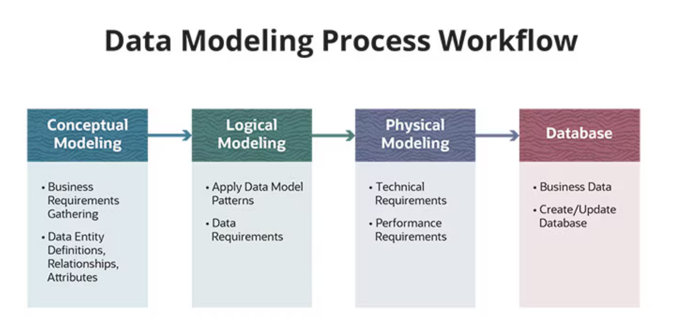
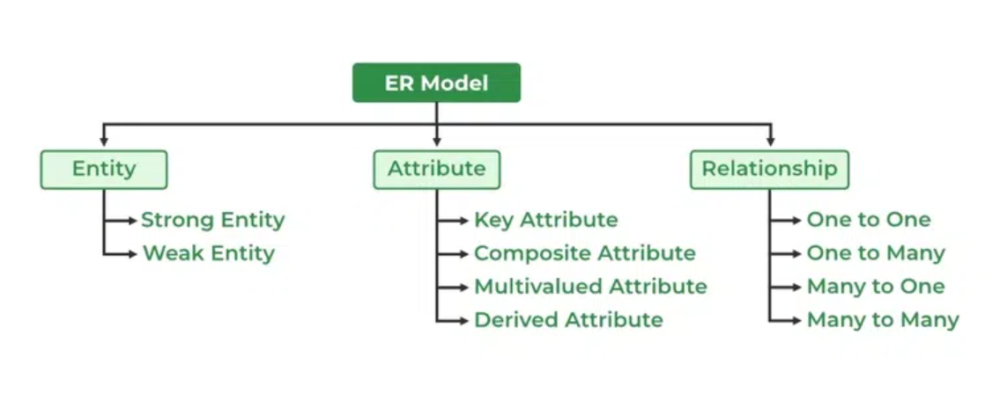
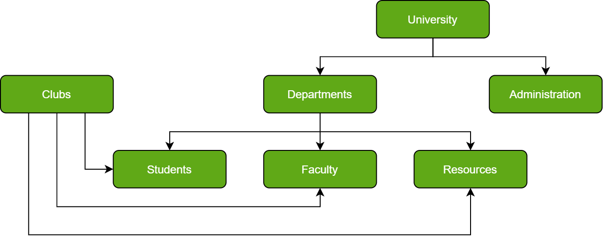

# Database Modeling
This document is to organize key concepts of database modeling 

# 0. Index
- **[1. Data modeling key features](/DatabaseModeling.md#1-three-key-elements-of-data-model)**
- **[2. Process of database design](/DatabaseModeling.md#2-process-of-database-design)**
- **[3. E-R data model](/DatabaseModeling.md#3-e-r-data-model)**
- **[4. Logical data modeling](/DatabaseModeling.md#4-logical-data-modelingexamples)**
 
# 1. Three key elements of data model
1. Data structure
2. Operations
3. Constraints

# 2. Process of database design
1. Specification and verification of requirements
2. Conceptual design
3. Logical design
4. Physical design
5. Implementation

## Conceptual design
Conceptual design aims at defining concepts of data for database. This stage includes transaction modeling.
ER model is one of the output from this stage.

## Logical design
This stage is to design transaction interfaces and evaluate data models(e.g ER model).
Normalization is performed in this stage.

## Physical design
Physical design stage considers how data is stored in a physical storage.
It also includes handling frequently requested data and distribution of it to implement stable database.

# 3. E-R data model
The Entity Relational Model is a model for identifying entities to be represented in the database and representation of how those entities are related. 
The ER data model specifies enterprise schema that represents the overall logical structure of a database graphically. 

## Components of ER Diagram
- Entity
- Attribute
- Relationship

# 4. Logical data modeling(Examples)
- ## Relational data model

  
- ## Hierarchical data model

  
- ## Network data model

# Reference
[Link](https://www.geeksforgeeks.org/types-of-databases/)

