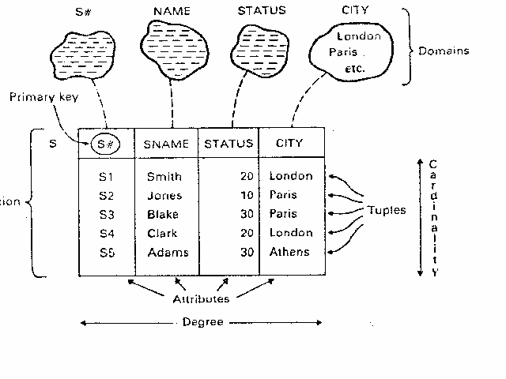
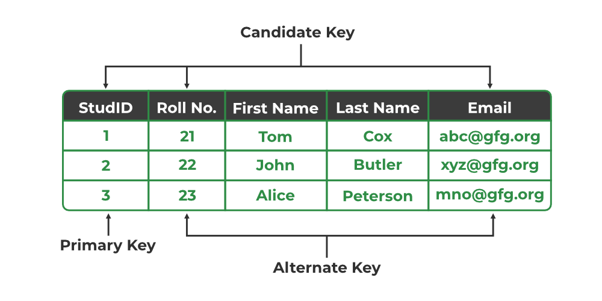
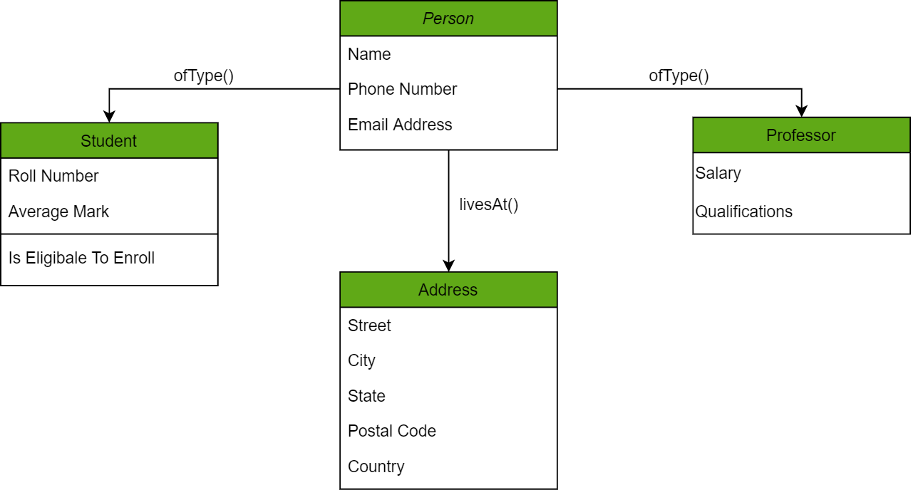

# Relational Database(RDB)
This document is to understand and organize key concepts of RDB

# 0. Index(to be revised)
- **[1. Data modeling key features](/DatabaseModeling.md#1-three-key-elements-of-data-model)**
- **[2. Process of database design](/DatabaseModeling.md#2-process-of-database-design)**
- **[3. E-R data model](/DatabaseModeling.md#3-e-r-data-model)**
- **[4. Logical data modeling](/DatabaseModeling.md#4-logical-data-modelingexamples)**

# 1. Basic concepts and terminology
- Schema: Specification of database structures and constraints.
- Relation instance: The set of values present in a relationship at a particular instance of time. A set of tupels that comform to the schema of the relation.
- Attribute: Properties that entities and relationships have. Represented as columns in a table.
- Tuple: A tuple is a row in a table.
- Degree: The number of attributes.
- Cardinality: The number of rows(tuples).

# 2. Types of keys in relational model

**1. Requirements for keys**
- Uniqueness: If the key can identify a unique tuple, it meets the uniqueness condition.
- Minimality: If the key consists of a minimal set of attributes to uniquely define a tuple, it meets the minimality condition.

**2. Types of keys**
- Super key: Keys that meet uniqueness but not minimality.
- Candidate key: Keys that meet both uniquness and minimality. These keys can be chonsen as primary key for the table.
- Primary Key: a unique key that identifies a unique value. It contains the minimal set of attributes and should not have NULL.
- Alternate Key: Candidate keys that are not chosen as primary key.
- Foreign key: Keys combine to two different relations. It should be a primary key in one of the relations and referenced.

**3. Constraints**
- Entity integrity: Primary keys must not have NULL value.
- Domain integrity: Values in a column should be a member of domain(the set of possible values for an attribute).
- Referential integrity: When a table is referenced, it should be mediated with a foreign key and make sure the existence of related tables.
  
# 3. Anomalies and Normalization
 
# 4. Relational calculus and algebra
1. Relational calculus: To define what the data and relationship is. Not to compute.
2. Relational algebra: Operational, providing a recipe for evaluation on the query. It is used to represent excution plans.
x

# 4. Logical data modeling(Examples)
- ## Relational data model

  
- ## Hierarchical data model

  
- ## Network data model

# Reference
[Link](https://www.geeksforgeeks.org/types-of-keys-in-relational-model-candidate-super-primary-alternate-and-foreign/?ref=lbp)

[Link](https://people.cs.pitt.edu/~chang/156/04reldb.html)

